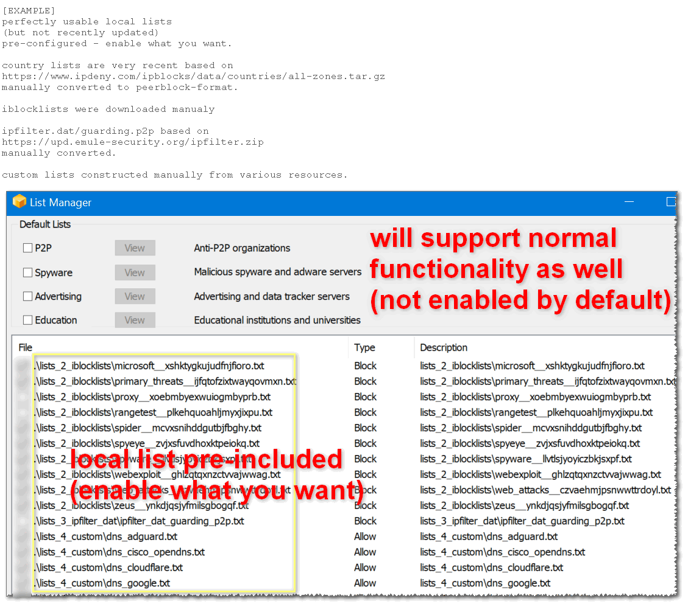
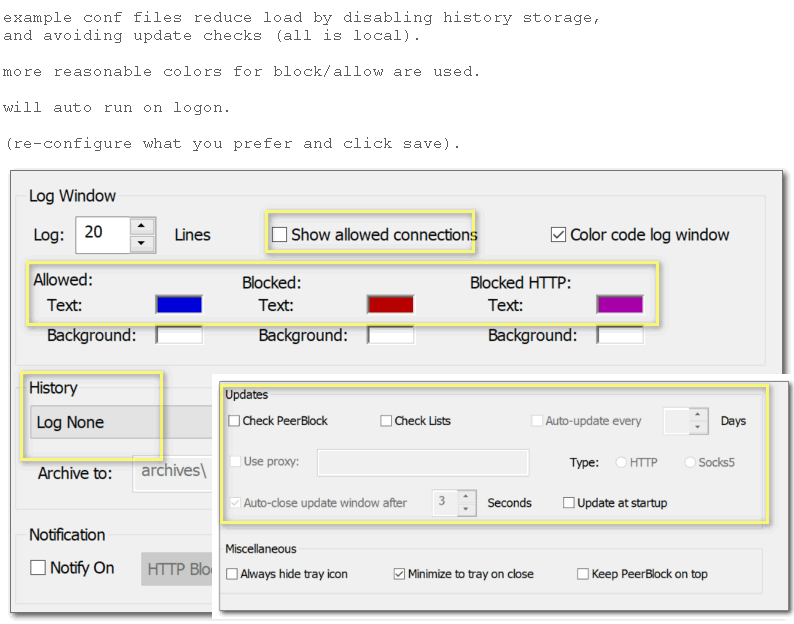
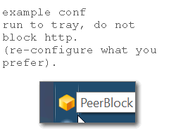
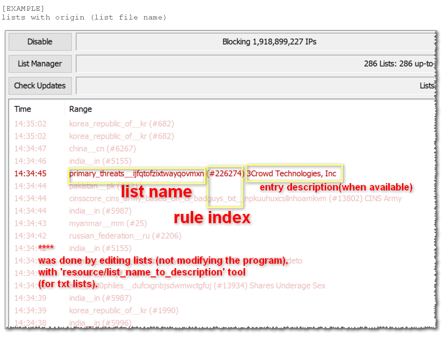

<h2>portable peerblock. pre-configured with local lists.</h2>

 

manual first time installation:
1. open `/lists/`, rename `_empty.permallow.p2b` to `permallow.p2b`, rename `_empty.permblock.p2b` to `permblock.p2b`.
2. either descide to use build 518 or 693 (assuming 518).
3. rename `_build518.example.peerblock.conf` to `peerblock.conf`, rename `_build518.pbfilter.sys` to `pbfilter.sys`, rename `_build518.peerblock.exe` to `peerblock.exe`.
4. right click the `peerblock.exe`, `properties`, <kbd>compatibility</kbd> tab, enable <kbd>☑︎ run this program as an administrator</kbd>. if possible click <kbd>change settings for all users<kbd>, enable <kbd>☑︎ run this program as an administrator</kbd> (click ok until all close).
5. double click once on `_clear_cache.cmd`.
6. double click once on `peerblock.exe` (if user notification shows up click allow, you can stop those notifications by running: start-run,`control` (enter), user accounts, `change user account control settings` and lowering the bar to never notify).
7. go to lists, and enable first two (`permallow.p2b` and `permblock.p2b`).
8. continue following the list, enabling your desired lists.
9. you can set peerblock to run automatically after logon. using the settings (if already checked, uncheck, click save, check, click save).
10. example configuration providede will not use online resources but local lists only (you can still use peerblock original functionality if you so choose, those will be updated by iblocklist servers which currently will allow once a week). a possibility to update lists directly from github will be added (it is just downloading the github files, those will be updated manually). for example: `https://github.com/eladkarako/tea_earl_grey_hot/raw/store/lists_1_country/antarctica__aq.txt` (or will be redirected to: `https://raw.githubusercontent.com/eladkarako/tea_earl_grey_hot/store/lists_1_country/antarctica__aq.txt` 

 
 
 

